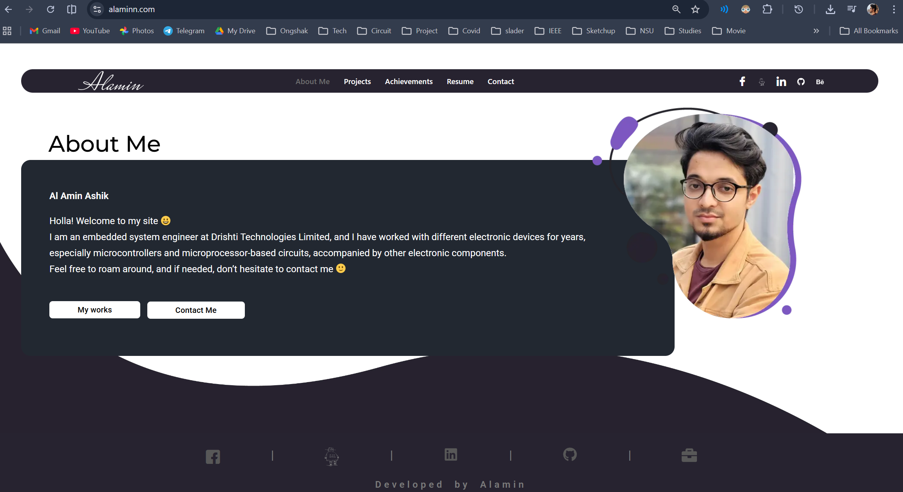

# Setting-up-a-personal-VPS-using-my-Banana-pi-M1

This repo contains all the processes and steps required to connected a domain from dianahost with server as my bananpi M1. I will expose my Banana Pi M1 (Armbian Lite) to the public internet and point my domain to it so it behaves like a VPS.

**Pre-requisite**
*   The bananpi M1 has only dual core processor and 1GB RAM, not enough to run a full Linux, so I used a CLI version of Armbian OS, which is very light.
*   OS (minimal) installed from Armbiarn website: `https://www.armbian.com/bananapi/`
*   The board has no on-board wifi chip, so it has to be constantly connected to ethernet port.
*   I already have a domain (alaminn.com) purchased from Dianahost, and I will connect the server with this domain.
*   Additionally, I used a 16GB memory card as the storage for this server.

#Notes: Since my ISP uses CG-NAT (Bangladesh sigh!), I cannot directly connect my domain with bananapi and I require use cloudfare as a tunnel. If only I had public IPv4, it wouldn't be an issue. But guess what? cloudflare provides free SSL, DDoS protection, cache reserve, and more for free. I see this as an absolute win!

## The steps are:

**Setting up Domain (I bought it from Dianahost):**
*   Go to the Cloudflare website.
*   Add your domain that is hosted on another platform(dianahost).
*   Press on a domain, and it will give 2 nameservers.
*   Go to the dianahost (your domain provider) domain list and change all the nameservers to the new nameservers.
*   Wait for some time, and you can verify whether the domain is live from the Cloudflare website.
*   Done, DNS is now controlled by Cloudflare.

**Setting up server on Bananapi (terminal)**

**Installing webserver:*
*   Install the Armbian Lite OS on a microSD card using your computer and load it onto the bananapi.
*   Connect the mouse, keyboard, and monitor to the bananapi. Set up and log in.
*   Install webserver by typing the following on the terminal `sudo apt install nginx`; this will also install "nginx-common";
*   Check if nginx is properly installed by typing `sudo nginx`; this may output several failed attempts, but it means it is working.
*   Install cloudflared `wget https://github.com/cloudflare/cloudflared/releases/latest/download/cloudflared-linux-arm`
*   move to local bin `sudo mv cloudflared-linux-arm /usr/local/bin/cloudflared`
*   add super user executable permission `sudo chmod +x /usr/local/bin/cloudflared`
*   check if properly installed `cloudflared --version`
    
**Authenticate tunnel from bananpi with Cloudflare:*
*   Once Cloudflare is installed, get the URL `cloudflared tunnel login`
*   Open the URL on the computer where **cloudfare is logged in** and authorize.
*   If authorization is successful, the terminal output on bananapi will show success.

**Get tunnel ID and edit contents:*
*   Get the Tunnel ID `cloudflared tunnel create bananapi-tunnel`. Remember, your tunnel name will be set as bananapi-tunnel.
*   Copy the tunnel ID at the end of the output from the previous command.
*   Create a tunnel configuration file `nano ~/.cloudflared/config.yml`
*   Add the following lines: (do not use tabs. use only spaces) 
`tunnel: YOUR-TUNNEL-ID` 
`credentials-file: /root/.cloudflared/YOUR-TUNNEL-ID.json` 
`ingress:` 
`  - hostname: yourdomain.com` 
`    service: http://localhost:80` 
`  - service: http_status:404` 
*   Make sure to change both the "Your-tunnel-ID" and "yourdomain.com" without http.
*   Route DNS automatically `cloudflared tunnel route dns bananapi-tunnel alaminn.com`, CloudFlare will now automatically create the DNS record. **if you get an error in this step, (1) log in to cloudflare (2) go to the DNS record of your domain (3) go to records (4) and delete the existing root domain record where 'name = @' and 'name = alaminn.com'

*   If you get an error regarding "failed to create record..", go to Cloudflare domain DNS > Records section, and delete the existing root record that has your domain name directly, e.g., "name = alaminn.com"

**Run the Tunnel on bananapi:*
*   Run the tunnel: `cloudflared tunnel run bananapi-tunnel`, if you get any error, check the config.yml file. Access the file: `nano ~/.cloudflared/config.yml`
*   Done, now it can be accessed on your website using mobile data. You will see a welcome nginx screen.
*   To stop the server, press ctrl+c. To start the server `cloudflared tunnel run bananapi-tunnel`

**Initialize Tunnel with startup:*
*   install a service `sudo cloudflared service install`
*   start the service `sudo systemctl start cloudflared`
*   enable the service `sudo systemctl enable cloudflared`
*   Check the status of running `systemctl status cloudflared`. Now the tunnel will run automatically when the BananaPi boots up. DONE.
*   The bananapi takes about 2-3 minutes to start everything after it is powered up.

## WordPress installation
**Install pre-requisites:*
*    I will now install WordPress, since I already have an existing portfolio website made using WordPress.
*    Install PHP and its modules: `sudo apt install php-fpm php-mysql php-curl php-gd php-mbstring php-xml php-zip php-intl`
*    Install database management system: `sudo apt install mariadb-server`
*    secure database: `sudo mysql_secure_installation`. If it gives an error, type this instead `sudo mariadb-secure-installation`
*    Set root password → 1234, switch to unix_socket → YES, Change root password → NO, Remove anonymous users → YES, Disallow root login remotely? → YES, Remove test database → YES, Reload privileges → YES
*    Remember the root password you entered; this will be used to access the database.
*    Now create a new database by using mariadb. Enter "sudo mysql -u root -p", enter the root password, and write the following lines:
`CREATE DATABASE mywordpress;` 
`CREATE USER 'wpuser'@'localhost' IDENTIFIED BY 'StrongPassword123!';` 
`GRANT ALL PRIVILEGES ON mywordpress.* TO 'wpuser'@'localhost';` 
`FLUSH PRIVILEGES;` 
`EXIT;` 
*    Keep in mind, your database credentials are:
        * database name: mywordpress
        * user name: wpuser
        * database password: StrongPassword123!

**Install WordPress:*
*    On the root terminal, go to the directory: `cd /var/www/`. Here, the WordPress files will be downloaded.
*    make a directory named WordPress `sudo mkdir wordpress`
*    enter the directory `cd wordpress`
*    Download WordPress: `sudo wget https://wordpress.org/latest.tar.gz`
*    Extract the zip file: `sudo tar -xzf latest.tar.gz`
*    Adjust permission: `sudo chown -R www-data:www-data /var/www/wordpress`
*    Adjust permission: `sudo chmod -R 755 /var/www/wordpress`

**Setup server for WordPress:*
*    Before configuring, find the PHP version: `php -v`, if it outputs something 8.4.16, then your PHP version is 8.4.
*    Create a configuration file for alaminn.com: `sudo nano /etc/nginx/sites-available/alaminn.com`. My php version was 8.4, so I used php8.4-fpm.sock; 
`server {` 
`    listen 80;` 
`    server_name alaminn.com;` 
`    root /var/www/wordpress/wordpress;` 
`    index index.php index.html index.htm;` 
`    location / {` 
`        try_files $uri $uri/ /index.php?$args;` 
`    }` 
`    location ~ \.php$ {` 
`        include snippets/fastcgi-php.conf;` 
`        fastcgi_pass unix:/run/php/php8.4-fpm.sock;` 
`    }` 
`    location ~ /\.ht {` 
`    deny all;` 
`    }` 
`}` 
*   Enable the site from available: `sudo ln -s /etc/nginx/sites-available/alaminn.com /etc/nginx/sites-enabled/`. Carefully change the alaminn.com to your domain.
*   remove the default enabled site: `sudo rm /etc/nginx/sites-enabled/default`. DONE
*   Test the server: `sudo nginx -t`. This will output 2 successes.
*   Finally, reload the server `sudo systemctl reload nginx`.
*   Preferably give final permission check: `sudo chown -R www-data:www-data /var/www/wordpress`
*   Check the website from your browser: `https://alaminn.com`

**Uploading manual WordPress backup files:*
*   I already had a exsisting website made using WordPress, so I copied all the resources to this new server.
*   Keep the database name, password, and URL exactly as in the wp-config.php file.
*   Edit the wp-config.php file using `sudo nano cd /var/www/wordpress/wordpress/wp-config.php`
*   If the website do not load, maybe there is an issue with HTTP and https, check both the database and the wp-config file.

## #Optimization
*   I converted all images into webp format.
*   Cloudflare gives free cache reserve, which is very helpful.
*   Removed unnecessary plug-ins and themes.
*   The home page needs to be as light as possible.

## #Making a CNC Enclosure
At this point, I realized the enclosure I was using is broken :(. Won't it be cool if I could make a premium casing using metal!

Well, JLCCNC now offers custom metal CNC for everyone at an affordable price, starting at just $1. The best thing is that you can get very small and very precise shapes using their 5-axis CNC machines.
Big thanks to JCLCNC for supporting this project! Click on the link below to get a coupon worth $123 at: https://jlccnc.com/?from=alaminashik

The Allwinner A20 processor can get a little toasty if multiple people are browsing the website at the same time, so it is better to add a heat sink along with a cooling fan. A 5V cooling fan can be directly connected to the PCB using a JST connector.
A little air flow makes a lot of difference.

## #How to manually take a backup of the website using the terminal
For this, we need to take backup of two directories, one is the wordpress folder, and another is the database. Here are the steps:
*    Connect to bananapi via ssh.
*    Move to the WordPress directory: `cd /var/www/wordpress`
*    Compress the directory that contains all WordPress files (i.e. wordpress): `sudo tar -zcvf archive_name.tar.gz directory_to_compress/`. Note: use `sudo tar -zcf ...` if you don't want to see all the verbose outputs on the screen.
*    After compression, I copied the file onto my laptop using: `scp archive_name.tar.gz mdalaminashik@192.168.x.xxx:/Users/mdalaminashik/Downloads`
*    Next export the target database: `sudo mariadb-dump -u [user_name] -p [database_name] > [output_file].sql`
*    When prompted, enter the password of the database. you can find the password, username, and name of the database from the wp-config file from wordpress directory.
*    After export, I copied the file onto my laptop using: `scp [output_file].sql mdalaminashik@192.168.x.xxx:/Users/mdalaminashik/Downloads`
*    And done taking the latest backup.

## Very important:
**I faced an issue where**
*    **Problem**: The site URL and home URL from WordPress dashboard settings/MySQL table could not both be https. the siteurl can be https, but not the home url, otherwise I cannot login to wp-admin. changing both to http worked, but in that case website is unstable, pictures could not load, and many issues prevailed since originally the website is https from cloudfare so there is an improper https detection. Even reinstalling mysql and wordpress did not solve the problem. This is solved by:
*    **Solved** by adding a condition on wp-config.php file. Add this condition before the line /* That's all, stop editing! Happy publishing. */ 
`define('FORCE_SSL_ADMIN', true);` 
`if (strpos($_SERVER['HTTP_X_FORWARDED_PROTO'], 'https') !== false) {` 
`    $_SERVER['HTTPS'] = 'on';` 
`} else {` 
`    $_SERVER['HTTPS'] = 'off';` 
`}` 

## Some basic uses of MariaDB
*   installing MariaDB: sudo apt install mariadb-server -y
*   secure database: sudo mysql_secure_installation. Set root password → YES, Remove anonymous users → YES, Disallow root remote login → YES, Remove test database → YES, Reload privileges → YES
*   opening mariadb: sudo mysql -u root -p
*   available databases: SHOW databases;

   *   creating a database:
        * CREATE DATABASE mywordpress;
        * CREATE USER 'wpuser'@'localhost' IDENTIFIED BY 'StrongPassword123!';
        * GRANT ALL PRIVILEGES ON mywordpress.* TO 'wpuser'@'localhost';
        * FLUSH PRIVILEGES;
        * EXIT;
     
   * showing tables: SHOW tables;
   * showing table content (i.e wordpress): SELECT option_name, option_value FROM wp_options WHERE option_name IN ('siteurl','home');
   * updating table content (i.e wordpress): UPDATE wpxz_options SET option_value='http://alaminn.com' WHERE option_name IN ('siteurl','home');
   * Vieweing all the users: SELECT User, Host FROM mysql.user;
   * removing a user: DROP USER 'wpuser'@'localhost';
